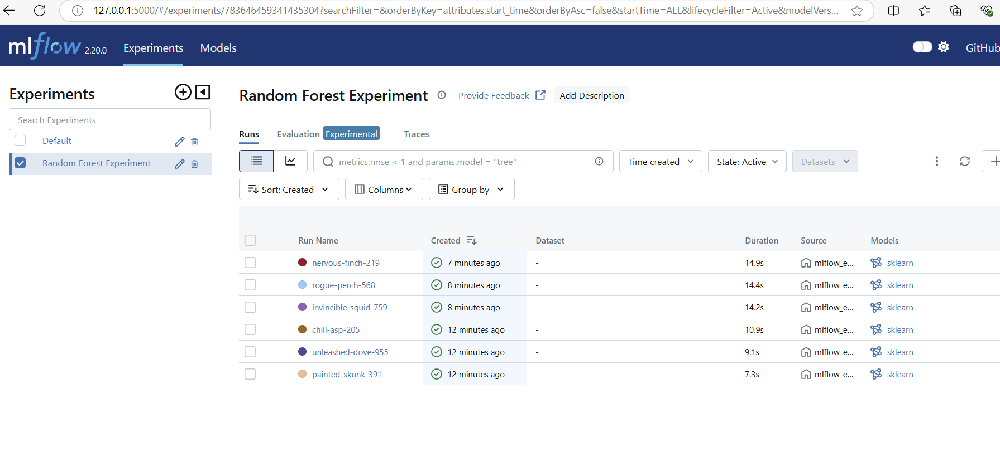
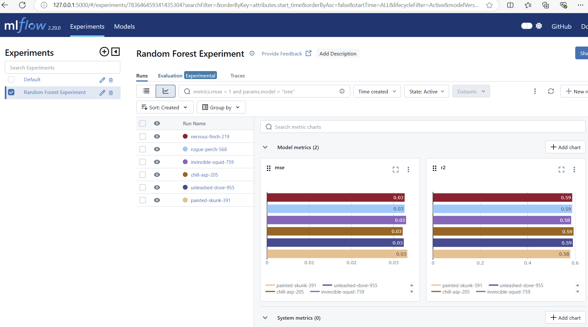

# Machine Learning Project

## Tasks

### 1. Data Versioning

- **Use DVC (Data Version Control) to version control a dataset used in your project.**
- **Show how to revert to a previous version of the dataset.**

## Deliverables

- **MLflow experiment logs with different runs and their results.**
- **A DVC repository showing different versions of the dataset.**

---
## Installation

To install the required packages, run the following command:

```bash
pip install -r requirements.txt
```

### Sample Output

```plaintext
Collecting dvc==3.58.0 (from -r requirements.txt (line 6))
    Downloading dvc-3.58.0-py3-none-any.whl.metadata (18 kB)
Requirement already satisfied: python-dateutil>=2.8.2 in c:\work\py312\lib\site-packages (from pandas==2.2.0->-r requirements.txt (line 1)) (2.9.0.post0)
Requirement already satisfied: pytz>=2020.1 in c:\work\py312\lib\site-packages (from pandas==2.2.0->-r requirements.txt (line 1)) (2024.2)
Requirement already satisfied: tzdata>=2022.7 in c:\work\py312\lib\site-packages (from pandas==2.2.0->-r requirements.txt (line 1)) (2025.1)
Requirement already satisfied: scipy>=1.6.0 in c:\work\py312\lib\site-packages (from scikit-learn==1.6.1->-r requirements.txt (line 3)) (1.15.1)
Requirement already satisfied: threadpoolctl>=3.1.0 in c:\work\py312\lib\site-packages (from scikit-learn==1.6.1->-r requirements.txt (line 3)) (3.5.0)
Requirement already satisfied: colorama in c:\work\py312\lib\site-packages (from pytest==8.3.4->-r requirements.txt (line 5)) (0.4.6)
Requirement already satisfied: iniconfig in c:\work\py312\lib\site-packages (from pytest==8.3.4->-r requirements.txt (line 5)) (2.0.0)
Requirement already satisfied: packaging in c:\work\py312\lib\site-packages (from pytest==8.3.4->-r requirements.txt (line 5)) (24.2)
Requirement already satisfied: pluggy<2,>=1.5 in c:\work\py312\lib\site-packages (from pytest==8.3.4->-r requirements.txt (line 5)) (1.5.0)
Collecting attrs>=22.2.0 (from dvc==3.58.0->-r requirements.txt (line 6))
    Downloading attrs-25.1.0-py3-none-any.whl.metadata (10 kB)
Collecting celery (from dvc==3.58.0->-r requirements.txt (line 6))
    Downloading celery-5.4.0-py3-none-any.whl.metadata (21 kB)
Collecting configobj>=5.0.9 (from dvc==3.58.0->-r requirements.txt (line 6))
    Downloading configobj-5.0.9-py2.py3-none-any.whl.metadata (3.2 kB)
Collecting distro>=1.3 (from dvc==3.58.0->-r requirements.txt (line 6))
    Downloading distro-1.9.0-py3-none-any.whl.metadata (6.8 kB)
Collecting dpath<3,>=2.1.0 (from dvc==3.58.0->-r requirements.txt (line 6))
    Downloading dpath-2.2.0-py3-none-any.whl.metadata (15 kB)
Collecting dulwich (from dvc==3.58.0->-r requirements.txt (line 6))
    Downloading dulwich-0.22.7-cp312-cp312-win_amd64.whl.metadata (4.5 kB)
Collecting dvc-data<3.17,>=3.16.2 (from dvc==3.58.0->-r requirements.txt (line 6))
    Downloading dvc_data-3.16.8-py3-none-any.whl.metadata (5.0 kB)
Collecting dvc-http>=2.29.0 (from dvc==3.58.0->-r requirements.txt (line 6))
    Downloading dvc_http-2.32.0-py3-none-any.whl.metadata (1.3 kB)
Collecting dvc-objects (from dvc==3.58.0->-r requirements.txt (line 6))
    Downloading dvc_objects-5.1.0-py3-none-any.whl.metadata (3.7 kB)
Collecting dvc-render<2,>=1.0.1 (from dvc==3.58.0->-r requirements.txt (line 6))
    Downloading dvc_render-1.0.2-py3-none-any.whl.metadata (5.4 kB)
Collecting dvc-studio-client<1,>=0.21 (from dvc==3.58.0->-r requirements.txt (line 6))
    Downloading dvc_studio_client-0.21.0-py3-none-any.whl.metadata (4.3 kB)
Collecting dvc-task<1,>=0.3.0 (from dvc==3.58.0->-r requirements.txt (line 6))
    Downloading dvc_task-0.40.2-py3-none-any.whl.metadata (10.0 kB)
Collecting flatten_dict<1,>=0.4.1 (from dvc==3.58.0->-r requirements.txt (line 6))
```


## Step-by-Step Instructions

### 1. Experiment Tracking

- **Use MLflow to track experiments for a machine learning project.**
- **Record metrics, parameters, and results of at least three different model training runs.**

1. **Install MLFlow Module**
```bash
    $ pip install mlflow
```
```plaintext
$pip install mlflow
    ...
    Installing collected packages: zipp, wrapt, waitress, sqlparse, pyasn1, pyarrow, protobuf, pillow, MarkupSafe, markdown, kiwisolver, itsdangerous, greenlet, graphql-core, fonttools, cycler, contourpy, cloudpickle, cachetools, blinker, Werkzeug, sqlalchemy, rsa, pyasn1-modules, matplotlib, Mako, Jinja2, importlib_metadata, graphql-relay, docker, deprecated, opentelemetry-api, graphene, google-auth, Flask, alembic, opentelemetry-semantic-conventions, databricks-sdk, opentelemetry-sdk, mlflow-skinny, mlflow

    Successfully installed Flask-3.1.0 Jinja2-3.1.5 Mako-1.3.8 MarkupSafe-3.0.2 Werkzeug-3.1.3 alembic-1.14.1 blinker-1.9.0 cachetools-5.5.1 cloudpickle-3.1.1 contourpy-1.3.1 cycler-0.12.1 databricks-sdk-0.41.0 deprecated-1.2.17 docker-7.1.0 fonttools-4.55.6 google-auth-2.38.0 graphene-3.4.3 graphql-core-3.2.5 graphql-relay-3.2.0 greenlet-3.1.1 importlib_metadata-8.5.0 itsdangerous-2.2.0 kiwisolver-1.4.8 markdown-3.7 matplotlib-3.10.0 mlflow-2.20.0 mlflow-skinny-2.20.0 opentelemetry-api-1.29.0 opentelemetry-sdk-1.29.0 opentelemetry-semantic-conventions-0.50b0 pillow-11.1.0 protobuf-5.29.3 pyarrow-18.1.0 pyasn1-0.6.1 pyasn1-modules-0.4.1 rsa-4.9 sqlalchemy-2.0.37 sqlparse-0.5.3 waitress-3.0.2 wrapt-1.17.2 zipp-3.21.0
```

2. **Run MLFlow**
    ```bash
    $ mlflow ui

    ##NOTE: Run from the same folder you\'re running the mlflow_execution.py
    ```
    ```plaintext
    (py312) C:\Users\sagar\OneDrive\Documents\My Docs\Education\BITS - MTECH\SME 3\MLOps\Assignment-1\diabetes-prediction>mlflow ui
    INFO:waitress:Serving on http://127.0.0.1:5000
    WARNING:waitress.queue:Task queue depth is 1
    WARNING:waitress.queue:Task queue depth is 2
    ```
3. **Evaluation Comparison**
    1. Different Model Execution/Run: 
        
    2. Evaluation Comparison
        

### 2. Data Versioning with DVC

1. **Install DVC:**
    ```bash
    pip install dvc
    ```

2. **Initialize DVC in your project:**
    ```bash
    dvc init
    ```

3. **Add your dataset to DVC:**
    ```bash
    dvc add data/dataset.csv
    ```
4. **Sample Output**

    ```plaintext
    (py312) C:\Users\sagar\OneDrive\Documents\My Docs\Education\BITS - MTECH\SME 3\MLOps\Assignment-1\diabetes-prediction>dvc init 
    Initialized DVC repository.

    You can now commit the changes to git.

    +---------------------------------------------------------------------+
    |                                                                     |
    |        DVC has enabled anonymous aggregate usage analytics.         |
    |     Read the analytics documentation (and how to opt-out) here:     |
    |             <https://dvc.org/doc/user-guide/analytics>              |
    |                                                                     |
    +---------------------------------------------------------------------+

    What's next?
    ------------
    - Check out the documentation: <https://dvc.org/doc>
    - Get help and share ideas: <https://dvc.org/chat>
    - Star us on GitHub: <https://github.com/iterative/dvc>
    ```

5. **Adding DVC Files to GitHub**

    After initializing DVC and adding your dataset, you need to add the DVC files to your Git repository. Run the following command:

    ```bash
    git status
    git add .dvc
    ```

    Sample Output:

    ```plaintext
    (py312) C:\Users\sagar\OneDrive\Documents\My Docs\Education\BITS - MTECH\SME 3\MLOps\Assignment-1\diabetes-prediction>git status
    On branch feature/code-cleanup
    Your branch is up to date with 'origin/feature/code-cleanup'.

    Changes to be committed:
        (use "git restore --staged <file>..." to unstage)
                    new file:   .dvc/.gitignore
                    new file:   .dvc/config
                    new file:   .dvcignore
                    new file:   .gitignore

    Changes not staged for commit:
        (use "git add/rm <file>..." to update what will be committed)
        (use "git restore <file>..." to discard changes in working directory)
                    modified:   README.md
                    modified:   m2-assignment-readme.md
                    deleted:    model/diabetes_model.pkl
                    modified:   requirements.txt
                    modified:   src/diabetes_model.py

    Untracked files:
        (use "git add <file>..." to include in what will be committed)
                    models/
    ```

    To commit the changes, run:


6. **Commit the changes:**
    ```bash
    git add .
    git commit -m "Add DVC files and dataset"
    git push origin feature/code-cleanup
    ```
    
7. **Show how to revert to a previous version of the dataset:**
    ```bash
    dvc checkout <commit_hash>
    ```

8. **Add remote connectivity for DVC as local:**
    ```bash
    dvc remote add -d local-remote dvc-remote
    Setting 'local-remote' as a default remote.
    ```
9. **DVC & GIT - for Version tracking**
    ```bash
        (py312) C:\Users\sagar\OneDrive\Documents\My Docs\Education\BITS - MTECH\SME 3\MLOps\Assignment-1\diabetes-prediction>git status
        On branch feature/code-cleanup
        Your branch is ahead of 'origin/feature/code-cleanup' by 2 commits.
        (use "git push" to publish your local commits)

        Changes to be committed:
        (use "git restore --staged <file>..." to unstage)
                new file:   data/.gitignore
                new file:   data/diabetes_prediction_dataset.csv.dvc
                modified:   m1-assignment-readme.md

    ```
10. **Updating Dataset with DVC**
    1. **Pull the latest version of the dataset:**
        ```bash
        dvc pull data/diabetes_prediction_dataset.csv
        ```

    2. **Make changes to the CSV file:**
        ```plaintext
        # Open the CSV file and make your changes
        ```

    3. **Track the changes with DVC:**
        ```bash
        dvc add data/diabetes_prediction_dataset.csv
        ```
        Sample Output:
        ```plaintext
            (py312) C:\Users\sagar\OneDrive\Documents\My Docs\Education\BITS - MTECH\SME 3\MLOps\Assignment-1\diabetes-prediction>dvc add data\diabetes_prediction_dataset.csv

            100% Adding...|█████████████████████████████████████████████████████████████████████████████████████████████████████████████████████████|1/1 [00:00, 10.87file/s] 

            To track the changes with git, run:

                    git add 'data\diabetes_prediction_dataset.csv.dvc'

            To enable auto staging, run:

                    dvc config core.autostage true

        ```

    4. **Push the updated dataset to the remote storage:**
        ```bash
        dvc push
        ```
        ```plaintext
        (py312) C:\Users\sagar\OneDrive\Documents\My Docs\Education\BITS - MTECH\SME 3\MLOps\Assignment-1\diabetes-prediction>dvc push
        Collecting                                                                                                                             |1.00 [00:00,  269entry/s]
        Pushing
        1 file pushed
        ```

    5. **Check the status of your Git repository:**
        ```bash
        git status
        ```
        ```plaintext
        (py312) C:\Users\sagar\OneDrive\Documents\My Docs\Education\BITS - MTECH\SME 3\MLOps\Assignment-1\diabetes-prediction>git status
        On branch feature/code-cleanup
        Your branch is up to date with 'origin/feature/code-cleanup'.

        Changes not staged for commit:
        (use "git add <file>..." to update what will be committed)
        (use "git restore <file>..." to discard changes in working directory)
                modified:   data/diabetes_prediction_dataset.csv.dvc

        no changes added to commit (use "git add" and/or "git commit -a")
        ```

    6. **Commit the changes to Git:**
        ```bash
        git add data/diabetes_prediction_dataset.csv.dvc
        git commit -m "Update dataset with new changes"
        git push origin feature/code-cleanup
        ```

    7. **Reset/Reload the old file or ignore changes - force load**

        ```plaintext
        (py312) C:\Users\sagar\OneDrive\Documents\My Docs\Education\BITS - MTECH\SME 3\MLOps\Assignment-1\diabetes-prediction>dvc pull --force
        Collecting                                                                                                                             |1.00 [00:00,  285entry/s]
        Fetching
        Building workspace index                                                                                                               |2.00 [00:00,  199entry/s]
        Comparing indexes                                                                                                                      |3.00 [00:00,  863entry/s] 
        Applying changes                                                                                                                       |0.00 [00:00,     ?file/s] 
        Everything is up to date.

        (py312) C:\Users\sagar\OneDrive\Documents\My Docs\Education\BITS - MTECH\SME 3\MLOps\Assignment-1\diabetes-prediction>dvc status
        data\diabetes_prediction_dataset.csv.dvc:
                changed outs:
                        modified:           data\diabetes_prediction_dataset.csv
        ```


### Common Errors

1. #### Git vs dvc tracking conflict
    If dvc is added for the file which is tracked by git, we will end up in error. We should untrack via git and track is via dvc

    ```sh
    (py312) C:\Users\sagar\OneDrive\Documents\My Docs\Education\BITS - MTECH\SME 3\MLOps\Assignment-1\diabetes-prediction>dvc add data\diabetes_prediction_dataset.csv

    Adding...                                                                                                                                                         
    ERROR:  output 'data\diabetes_prediction_dataset.csv' is already tracked by SCM (e.g. Git).                                                                       
        You can remove it from Git, then add to DVC.
            To stop tracking from Git:
                git rm -r --cached 'data\diabetes_prediction_dataset.csv'
                git commit -m "stop tracking data\diabetes_prediction_dataset.csv"
    ```

    #### Solution: 
    ```bash
    git rm -r --cached data\diabetes_prediction_dataset.csv

    #commit the change to git
    git commit -m "stop tracking dvs files"

    # once we untrack from git, run the tracking via dvc
    dvc add data\diabetes_prediction_dataset.csv
    ```
    ```plaintext

    (py312) C:\Users\sagar\OneDrive\Documents\My Docs\Education\BITS - MTECH\SME 3\MLOps\Assignment-1\diabetes-prediction>dvc add data\diabetes_prediction_dataset.csv

    100% Adding...|█████████████████████████████████████████████████████████████████████████████████████████████████████████████████████████|1/1 [00:00,  5.98file/s] 

    To track the changes with git, run:

            git add 'data\.gitignore' 'data\diabetes_prediction_dataset.csv.dvc'

    To enable auto staging, run:

    dvc config core.autostage true
    ```

2. #### dvc-remote tracking
    Avoid tracking dvc-remote, we will add in gitignore. 
    ```bash
    >> touch .gitignore
    >> dvc-remote
    ```

3. #### dvc add issues
    Avoid tracking dvc-remote, we will add in gitignore. 
    ```bash
    (py312) C:\Users\sagar\OneDrive\Documents\My Docs\Education\BITS - MTECH\SME 3\MLOps\Assignment-1\diabetes-prediction>dvc add .
    ERROR: Path: c:\users\sagar\onedrive\documents\my docs\education\bits - mtech\sme 3\mlops\assignment-1 does not overlap with base path: c:\users\sagar\onedrive\documents\my docs\education\bits - mtech\sme 3\mlops\assignment-1\diabetes-prediction
    ```
     #### Solution: Add the exact path to dvc add, if you're using relative make sure you provide reference or parent ref.
     ```bash
    dvc add data\diabetes_prediction_dataset.csv
     ```

